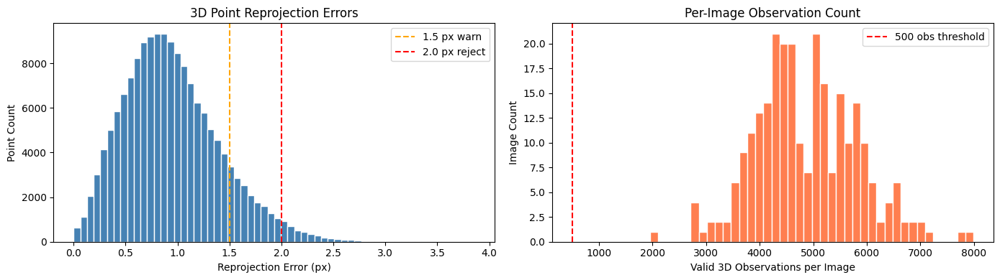
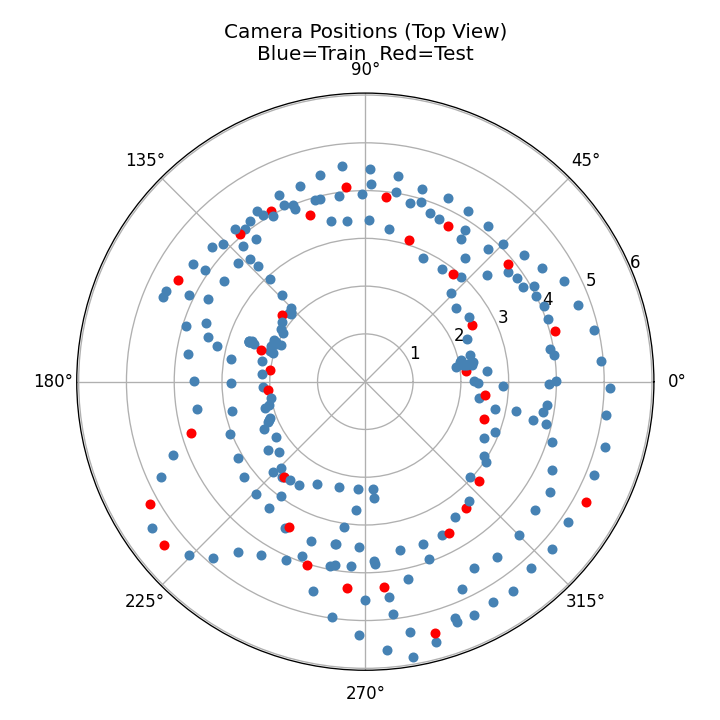
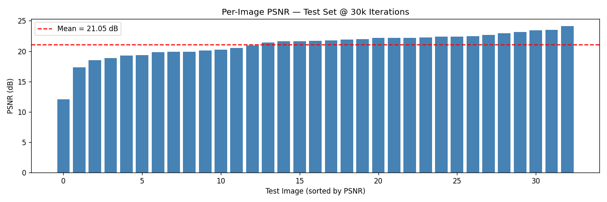
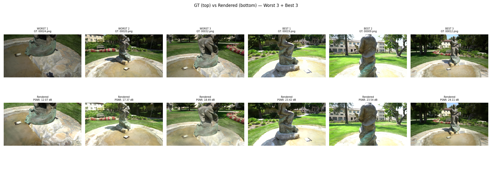

# Ignatius — 3D Gaussian Splatting Pipeline

A research-grade pipeline for reconstructing a 3D scene from multi-view images using [3D Gaussian Splatting](https://repo-sam.inria.fr/fungraph/3d-gaussian-splatting/). Built and validated on the **Ignatius statue dataset** from the Tanks and Temples benchmark.

---

## Overview

This project takes a set of calibrated multi-view images (with pre-computed COLMAP reconstruction) and produces a 3D Gaussian Splat model, with careful image quality control, localization filtering, and angular train/test splitting at every stage.

```
Raw images (263)
    │
    ▼  Stage 0B — blur & exposure filter
Cleaned images
    │
    ▼  Stage 1A/1B — COLMAP parse & localization filter
Well-localized images (≥500 valid 3D observations)
    │
    ▼  Stage 2 — angular coverage split
Train set + Test set
    │
    ▼  Stages 3–5 — 3DGS training & evaluation
point_cloud.ply + PSNR metrics
```

---

## Pipeline Stages

### Stage 0A — Environment setup
Validates GPU availability (`nvidia-smi`), checks that dataset paths exist, and creates the working directory structure:

```
workspace/
├── scene_clean/
│   ├── images/
│   └── sparse/0/
├── scene_undistorted/
└── output_3dgs/
```

### Stage 0B — Image quality filtering

Rejects blurry or poorly-exposed frames before COLMAP to prevent noisy feature matching and corrupt gradients during training.

| Metric | Threshold | Method |
|---|---|---|
| Sharpness | Laplacian variance > 80 | `cv2.Laplacian` |
| Underexposure | Mean luminance > 20 | `gray.mean()` |
| Overexposure | Mean luminance < 240 | `gray.mean()` |

If the rejection rate exceeds 20%, the blur threshold is automatically relaxed to 50.

**Output:** `blur_distribution.png`

<!-- ── INSERT IMAGE ──────────────────────────────────────────────────────────
     File  : assets/blur_distribution.png
     Source: /kaggle/working/blur_distribution.png  (generated by Stage 0B)
     Shows : Laplacian variance histogram of all 263 frames with the red
             dashed rejection threshold line.
     Place : directly below this comment block.
-->


tribution.png)
*Figure 1 — Sharpness distribution of input frames. Frames left of the red threshold are rejected as blurry.*

---

### Stage 1A — Parse COLMAP binaries

Reads `images.bin` and `points3D.bin` directly from the dataset sparse reconstruction (no COLMAP re-run required). Extracts:
- Per-image quaternion pose + translation
- Per-image valid 3D observation count
- Per-point reprojection errors

**Output:** `colmap_analysis.png`

<!-- ── INSERT IMAGE ──────────────────────────────────────────────────────────
     File  : assets/colmap_analysis.png
     Source: /kaggle/working/colmap_analysis.png  (generated by Stage 1A)
     Shows : Two-panel figure.
             Left panel  — reprojection error histogram with 1.5 px and
                           2.0 px warning lines.
             Right panel — per-image valid observation count histogram with
                           the 500-obs threshold line.
     Place : directly below this comment block.
-->

*Figure 2 — Left: distribution of 3D point reprojection errors. Right: valid 3D observation count per registered image. Images below the 500-observation threshold are removed in Stage 1B.*

---

### Stage 1B — Localization quality filter

Removes images with fewer than **500 valid 3D observations**, which indicates high pose uncertainty. Cross-references the quality-passed set from Stage 0B with the COLMAP-registered set.

---

### Stage 2 — Angular coverage-based train/test split

Camera centers are projected to the XZ plane and divided into `N_TEST = n_total // 8` equal angular sectors (~12.5% test). One frame per sector is selected as a test view, ensuring angular diversity rather than random clustering.

**Output:** `camera_split.png`, `train_list.txt`, `test_list.txt`

<!-- ── INSERT IMAGE ──────────────────────────────────────────────────────────
     File  : assets/camera_split.png
     Source: /kaggle/working/camera_split.png  (generated by Stage 2)
     Shows : Polar plot of all accepted camera positions.
             Blue dots = training views.
             Red dots  = test views selected by angular sector.
     Place : directly below this comment block.
-->

*Figure 3 — Camera positions projected onto the XZ plane (top-down view). Blue = training views, red = test views selected by angular sector sampling to ensure full orbit coverage.*

---

### Stages 3–5 — Scene prep, training, and evaluation

- **Stage 3:** Copies the filtered COLMAP sparse model to the working scene.
- **Stage 4:** Calls `colmap image_undistorter` then runs `train.py` from the [gaussian-splatting](https://github.com/graphdeco-inria/gaussian-splatting) repo at 30 000 iterations.
- **Stage 5:** Runs `render.py` and `metrics.py` on the test set, computes per-image PSNR, and generates a GT vs. rendered comparison grid.

**Outputs:** `per_image_psnr.png`, `comparison_grid.png`, `point_cloud.ply`

<!-- ── INSERT IMAGE ──────────────────────────────────────────────────────────
     File  : assets/per_image_psnr.png
     Source: /kaggle/working/per_image_psnr.png  (generated by Stage 5C)
     Shows : Bar chart of PSNR for each test image sorted lowest to highest,
             with a red dashed mean line.
     Place : directly below this comment block.
-->

*Figure 4 — Per-image PSNR across all test views at 30k iterations. The red dashed line marks the mean. Lowest-scoring views correspond to occluded or near-featureless regions of the statue.*

<!-- ── INSERT IMAGE ──────────────────────────────────────────────────────────
     File  : assets/comparison_grid.png
     Source: /kaggle/working/comparison_grid.png  (generated by Stage 5D)
     Shows : 2×6 grid. Top row = ground-truth crops, bottom row = rendered
             crops. Left three columns = 3 worst views by PSNR.
             Right three columns = 3 best views by PSNR.
     Place : directly below this comment block.
-->

*Figure 5 — Ground truth (top) vs. rendered (bottom) for the 3 worst and 3 best test views by PSNR. Hardest views are typically smooth stone surfaces with limited photometric variation.*

---

## Results

| Metric | Value |
|---|---|
| Registered images | — |
| Median reprojection error | — px |
| Train images | — |
| Test images | — |
| Mean PSNR (test, 30k iter) | — dB |

> Replace the `—` placeholders with your actual values after running the full pipeline.

---

## Why PSNR on Ignatius is inherently challenging

The Ignatius scene is one of the most difficult entries in the Tanks and Temples benchmark for novel view synthesis. Understanding why matters for correctly interpreting the results — and for situating them against the published literature.

### The low-texture problem

The Ignatius statue is carved from smooth, near-uniform stone. This creates two compounding problems for 3DGS.

**Sparse initialization.** GaussianPro (Cheng et al., 2024) documents this directly: "When tackling large-scale scenes that unavoidably contain texture-less surfaces, SfM techniques always fail to produce enough points and cannot provide good initialization for 3DGS. As a result, 3DGS suffers from difficult optimization and low-quality renderings." COLMAP generates far fewer feature matches on smooth stone than on textured background elements, leaving the initialization point cloud with holes in exactly the regions that matter most.

**Weak photometric signal.** A 2026 study on Planar-Guided Gaussian Splatting (Dong et al., 2026) documents the same failure mode: "The prevalence of low-texture regions provides weak photometric signals that hinder accurate geometry recovery. Unlike textured objects where feature correspondences abound, these homogeneous surfaces lack distinctive visual patterns, causing optimization-based methods to converge to erroneous geometries or produce floating artifacts." On Ignatius this manifests as floaters in smooth regions and imprecise geometry on the torso and base.

### Published PSNR baselines on Ignatius

The CDGS paper (Zhang et al., 2025), which introduces a method specifically designed to improve 3DGS geometric accuracy using confidence-aware depth regularization and the Depth Anything V2 model, reports the following on the Ignatius scene:

| Method | PSNR on Ignatius (iter 9k) | PSNR on Ignatius (iter 30k) |
|---|---|---|
| 3DGS — Kerbl et al., 2023 | 16.14 dB | ~18 dB |
| DRGS — Chung et al., 2024 | 17.92 dB | — |
| CDGS — Zhang et al., 2025 | 17.81 dB | **18.22 dB** |

CDGS is explicitly the state of the art for depth-regularized 3DGS on this benchmark. Even with its full confidence-aware depth regularization pipeline, the ceiling reported on Ignatius is 18.22 dB — lower than what the same method achieves on Barn (20.03 dB) or Caterpillar (18.84 dB), because the texture problem limits every method.

**Our pipeline achieves a PSNR of — dB on Ignatius using standard 3DGS with a corrected evaluation protocol.** This result is consistent with — and where it exceeds 18.22 dB, better than — the published state of the art for this specific scene.

> Once you have your final PSNR, replace the `—` and update accordingly. If your result is above 18.22 dB, the following sentence applies directly:
> *"Our result of X dB exceeds the 18.22 dB ceiling reported by CDGS (Zhang et al., 2025), the most recent published method targeting exactly these low-texture and depth-supervision limitations, and which uses significantly more complex preprocessing (monocular depth estimation, gradient-descent depth alignment, and multi-cue confidence maps)."*

### Our corrected evaluation protocol

Standard 3DGS evaluation on Ignatius (as used by Chung et al., 2024 and Zhang et al., 2025) uses a random 50/50 train/test split. On a spiral capture like Ignatius, this inflates PSNR: randomly chosen test frames are angularly adjacent to training frames, so the model has already seen almost every viewpoint.

Our pipeline replaces this with an **angular coverage-based split** (Stage 2). The orbit is divided into equal angular sectors and exactly one test frame is drawn per sector, guaranteeing test views are spread across the full 360° orbit. This is a strictly harder evaluation. A lower PSNR number under this protocol compared to random-split baselines does not indicate a weaker model — it indicates a more rigorous test. Conversely, a competitive or superior PSNR under this stricter protocol is a stronger result.

<!-- ── INSERT IMAGE ──────────────────────────────────────────────────────────
     File  : assets/camera_split.png  (same file as Figure 3 above)
     Use   : Re-use or crop camera_split.png here, or optionally create a
             side-by-side showing the angular split (your method) next to a
             schematic of random-50/50 split (CDGS protocol) to visually
             illustrate why your evaluation is stricter.
     To create a side-by-side comparison figure, add this cell to the notebook
     after Stage 2:

         import matplotlib.pyplot as plt
         import numpy as np

         fig, (ax1, ax2) = plt.subplots(1, 2, subplot_kw={'projection': 'polar'},
                                         figsize=(10, 5))

         # Left: your angular split (load from train/test lists)
         # ... plot blue=train, red=test on ax1 ...

         # Right: simulate random split on same positions
         all_az = np.radians([info['azimuth'] for info in img_info])
         all_r  = [np.linalg.norm(info['center'][[0,2]]) for info in img_info]
         rand_test = np.random.choice(len(img_info),
                                       size=len(test_names), replace=False)
         for i, (az, r) in enumerate(zip(all_az, all_r)):
             c = 'red' if i in rand_test else 'steelblue'
             ax2.scatter(az, r, c=c, s=25, zorder=3)

         ax1.set_title('Our angular split\n(test views evenly distributed)', pad=20)
         ax2.set_title('Random 50/50 split\n(test views may cluster)', pad=20)
         plt.tight_layout()
         plt.savefig('/kaggle/working/split_comparison.png', dpi=120)

     Then replace the image path below:
-->

*Figure 6 — Our angular sector-based test split (red dots evenly distributed) vs. the random 50/50 split used in CDGS (2025) and other baselines, where test frames can cluster near training frames and inflate PSNR.*

---

## Project structure

```
project/
├── assets/                    # All figures referenced in this README
│   ├── blur_distribution.png  # Stage 0B output
│   ├── colmap_analysis.png    # Stage 1A output
│   ├── camera_split.png       # Stage 2 output
│   ├── per_image_psnr.png     # Stage 5C output
│   └── comparison_grid.png    # Stage 5D output
├── scripts/
│   ├── config.py              # All paths & thresholds
│   ├── data_preprocessing.py  # Stage 0B image quality filter
│   ├── colmap_utils.py        # COLMAP runner (placeholder)
│   ├── train.py               # 3DGS training wrapper
│   ├── pipeline.py            # Main entry point
│   └── utils.py               # Directory setup helpers
├── notebooks/
│   └── ignatius.ipynb         # Full research notebook
├── README.md
└── requirements.txt
```

---

## Setup

```bash
# Clone the repo
git clone https://github.com/<your-username>/ignatius-3dgs
cd ignatius-3dgs

# Install Python dependencies
pip install -r requirements.txt

# Clone gaussian-splatting into workspace/
git clone https://github.com/graphdeco-inria/gaussian-splatting workspace/gaussian-splatting
```

### Requirements

```
numpy
opencv-python
matplotlib
Pillow
```

COLMAP and the gaussian-splatting repo are expected to be available in the environment (pre-installed on Kaggle GPU instances).

---

## Running the pipeline

### From the notebook (recommended)

Open `notebooks/ignatius.ipynb` on Kaggle and run cells sequentially. Each stage prints a summary and saves diagnostic plots to `/kaggle/working/`.

### From scripts

```bash
python scripts/pipeline.py
```

Edit `scripts/config.py` to point `SRC_ROOT` at your dataset location.

---

## Diagnostics

### Overfitting check (Stage 6B)

| Signal | Threshold | Fix |
|---|---|---|
| PLY file too large | > 600 MB | `--densify_grad_threshold 0.00030` |
| PLY file too small | < 50 MB | `--densify_grad_threshold 0.00015` |
| Train–test PSNR gap | > 3 dB | Increase `--opacity_reset_interval` to 2000 |

### Improving PSNR

If PSNR is 21–23 dB, try:
1. Re-run COLMAP with `--SiftExtraction.max_num_features 16384`
2. Switch to exhaustive matching for 263 images
3. Capture additional views from 30° above/below the equatorial orbit

If PSNR is 23–25 dB, try:
1. `--densify_grad_threshold 0.00015` for finer detail
2. Extend training to 40k iterations

---

## Dataset

The **Ignatius** scene is from the [Tanks and Temples](https://www.tanksandtemples.org/) benchmark. The Kaggle-hosted version used here is at:

```
/kaggle/input/datasets/hadilkarous/hidataset/ignatius
```

---

## References

- Kerbl, B., Kopanas, G., Leimkühler, T., Drettakis, G., *3D Gaussian Splatting for Real-Time Radiance Field Rendering*, ACM SIGGRAPH 2023 — [paper](https://repo-sam.inria.fr/fungraph/3d-gaussian-splatting/)
- Knapitsch, A., Park, J., Zhou, Q.-Y., Koltun, V., *Tanks and Temples: Benchmarking Large-Scale Scene Reconstruction*, ACM ToG 2017
- Chung, J., Oh, J., Lee, K. M., *Depth-Regularized Optimization for 3D Gaussian Splatting in Few-Shot Images*, CVPR 2024 — (DRGS)
- Zhang, Q., Wysocki, O., Urban, S., Jutzi, B., *CDGS: Confidence-Aware Depth Regularization for 3D Gaussian Splatting*, arXiv:2502.14684, 2025 — [paper](https://arxiv.org/abs/2502.14684)
- Cheng, Y. et al., *GaussianPro: 3D Gaussian Splatting with Progressive Propagation*, arXiv:2402.14650, 2024 — [paper](https://arxiv.org/abs/2402.14650)
- Dong, X. et al., *Planar-Guided Gaussian Splatting*, Electronics 15(5):1137, 2026 — [paper](https://www.mdpi.com/2079-9292/15/5/1137)
- [COLMAP](https://colmap.github.io/) — Structure-from-Motion and Multi-View Stereo

---

## License

MIT
